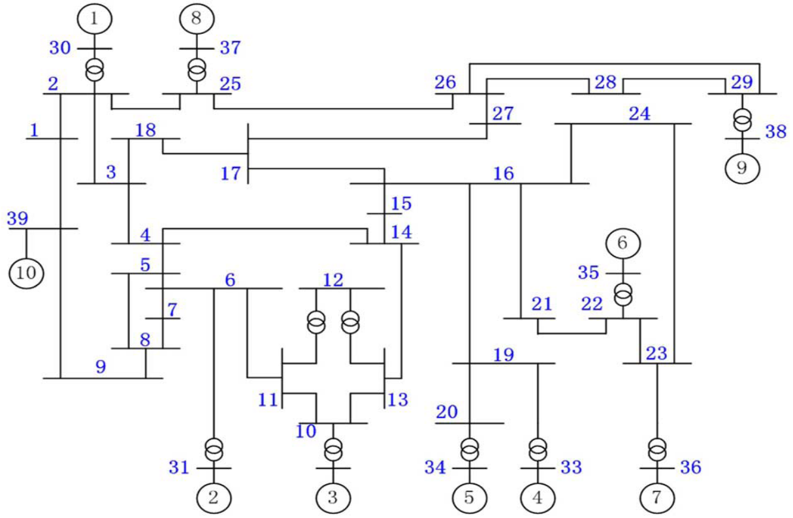

# Actividad-1-Metodos-Computacionales
Calculo de flujo de potencia DC y análisis de contingencias n-1

**Tarea nro.1 : Representación matricial de la red**
*Flujo de carga DC y análisis de contingencias*

En este proyecto desarrollamos un modelo de flujo de carga DC para analizar la operación de un sistema de potencia bajo condiciones - normales y contingencias **N-1**. Para ello, seguimos una metodología estructurada en cuatro etapas:

1. *Construcción de Matrices de Red:* 
   * Calculamos la matriz de admitancia Ybus a partir de los parámetros de las líneas (resistencia, reactancia y susceptancia).
   * Derivamos la matriz de susceptancia Bbus simplificada (ignorando resistencias y cargas shunt), excluyendo la barra slack 
   para garantizar invertibilidad.

2. *Cálculo de Flujos de Potencia DC:*
   * Determinando los angulos nodales $\theta_N = B_{bus}^{-1}*P_{N}$, teniendo en cuenta el nodo slack $\theta_{slack} = 0$ .
   * Hallando los flujos de potencia en líneas ($P_{km}$) mediante $P_{km} = \frac{\theta_k-\theta_m}{x_N}$.

3. *Análisis de Contingencias N-1:*
   * Evaluamos la seguridad del sistema al desconectar cada línea individualmente, recalculando Bbus modificada y verificando:
        * Si la matriz resultante era invertible (evitando islas).
   * Identificamos casos críticos (líneas cuya desconexión provoca sobrecargas o colapsos).

4. *Visualización de Resultados:*
   * Generación de mapas de calor para los angulos nodales $\theta_N$ y los flujos de potencia $P_{km}$

*Figura 1: Diagrama unifilar del sistema de potencia*

**Marco teórico**
El marco teórico de este trabajo se fundamenta en los principios de análisis de sistemas de potencia, específicamente en el modelo de flujo de carga DC y su aplicación para evaluar la seguridad del sistema bajo contingencias N-1. A continuación, se detallan los conceptos clave:

1. *Modelado de un sistema eléctrico de potencia:*
    * Matriz de admitancia nodal ($Y_{bus}$):
      Representa las conexiones físicas del sistema y se construye a partir de las admitancias de líneas y transformadores. Para una línea entre los nodos $k$ y $m$, su contribución $Y_{bus}$ es:$\newline$
      $Y_{kk} += y_{km}$, $Y_{km} = Y_{mk} -= y_km$ $\newline$
      Donde $y_km = \frac{1}{r_{km}+j*x_{km}}$ $\newline$
   $\newline$
   * *Supuestos del Flujo DC:* $\newline$
      * Resistencias desprecciables ($r \ll x$): las perdidas de potencia activa se desprecian. $\newline$
      * Tensiones constantes: $V_{k} \approx 1 p.u.$
      * Cargas modeladas como constantes: No dependen del voltaje. $\newline$
$\newline$
2. *Matriz de Susceptancia Nodal $(B_{bus})$:*
   * Es una simplificación de $Y_{bus}$ para flujo DC, donde se omiten las resistencias ($r = 0$) y y las susceptancias shunt. Esta matriz es simétrica, singular (suma de filas = 0) y se vuelve invertible al excluir la barra slack. $\newline$
$\newline$
3. *Flujo de Carga DC:*
   * Ecuación Fundamental:
   $[P_{N}]= [B_{bus}]*[\theta]$
   Donde $P_{N}$ es el vector de potencias nodales (inyecciones netas) $\newline$ ($P_{gen} - P_{Load}$) y $\theta$ los ángulos de tensión.

**Funciones:**

**calcular_ybus:**

*Requiere*

    - using LinearAlgebra
    - using DataFrames
    - using CSV
    - using Plots

    Entradas:  

    - lines: DataFrames
    - nodes : DataFrames

    Salida :    

    - Ybus : matriz

**B_bus:**

*Requiere*

    - using LinearAlgebra
    - using DataFrames
    - using CSV
    - using Plots

    Entradas:  

    - lines: DataFrames
    - nodes : DataFrames

    Salida :    

    - Bbus : matriz

**flujo_dc:**

*Requiere*

    - using LinearAlgebra
    - using DataFrames
    - using CSV
    - using Plots

    Entradas:   
    
    -  lines: DataFrames
    -  nodes : DataFrames

    Salida : 

    -  P_km (P_lineas) : Vector
    -  θ : Vector

**flujo_dc_data:**

*Requiere*

    - using LinearAlgebra
    - using DataFrames
    - using CSV
    - using Plots

    Entradas:   
    
    -  lines: DataFrames
    -  nodes : DataFrames

    Salida : 
       
    -  P_km (P_lineas) : DataFrame
    -  θ : DataFrame

**es_invertible:**

*Requiere*

    - using LinearAlgebra
    - using DataFrames
    - using CSV
    - using Plots

    Entradas:   
    
    -  matriz: matriz cuadrada a evaluar

    Salida : 
       
    -  true: si la matriz es invertible (det != 0)
    -  false: si la matriz no es invertible (det aproximadamente igual a 0 o la operación falla)

**contingencias**

*Requiere*

    - using LinearAlgebra
    - using DataFrames
    - using CSV
    - using Plots

    Entradas:   
    
    -  lines: DataFrames
    -  nodes : DataFrames

    Salida : 
       
    -  P_km (P_lineas) : DataFrame
    -  θ : DataFrame

    Nota: Estas contingencias son n-1

**Licencia**

Programa realizado por: Juan Manuel Martínez Estrada
manuel.martinez1@utp.edu.co

[![License : CC BY-NC-SA 4.0] (https: img.shields.io/badge/License-CC_BY--NC--SA--4.0-lightgrey)]
